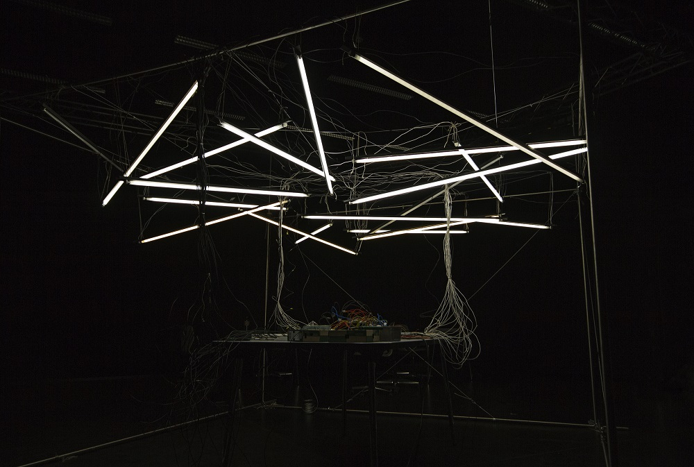
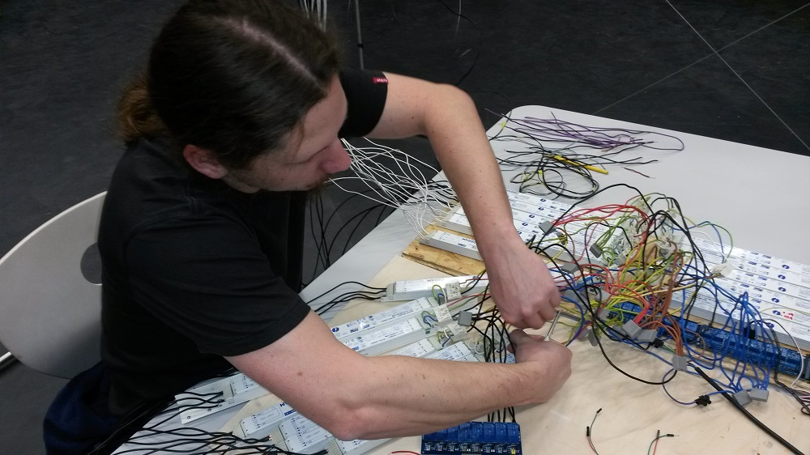

Residenzgalerie
===============

### Project description:
The project Residenzgalerie are multiple installations for an exhibition of the <a href="http://www.residenzgalerie.at">Residenzgalerie Salzburg</a> which is a museum, with high-quality 16th-19th - century paintings. The concept for the exhibition was made by students of the master degree courses <a href="http://www.fh-salzburg.ac.at/disziplinen/medien-design-kunst/bachelor-multimediaart/beschreibung/beschreibung/">Multimedia Art</a> and <a href="http://www.fh-salzburg.ac.at/disziplinen/medien-design-kunst/bachelor-multimediatechnology/beschreibung/beschreibung/">Multimedia Technology</a>. A detailed project description can be found <a href="https://www.facebook.com/pages/ANTON/1422894151264133">here</a>.

### Light installation:
The light installation is based on the following components:
* Arduino Mega
* 8 channel 5V relais module for Arduino
* Breadboard
* Wires

### Sound installation:
The sound installation is based on the following components:
* Arduino Uno
* Raspberry Pi
* USB cable
* LV-MaxSonar - EZ1
* Wires

1. Raspberry Pi Setup:
The Raspberry Pi runs on raspbian OS and uses the node.js version 0.10.12. I put the node.js programm
The node.js programm starts from /etc/rc.local as forever process:
* Install <a href="https://github.com/nodejitsu/forever">forever</a>
* open /etc/rc.local and attach: /pathToForever start /pathToYourNodeJsScript
* don't forget to link node: sudo ln -s /pathToNodeJs /usr/bin/node
* force the raspberryPi to use the sereo jack: amixer cset numid=3 1

